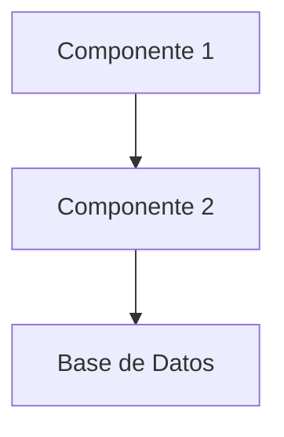
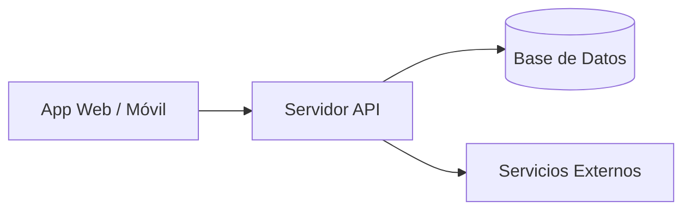

# Documento de Arquitectura de Solución — [Nombre del Proyecto]

**Fecha:** [fecha]
**Versión:** 1.0
**Basado en:** [referencia al documento de requisitos, si existe]

---

## 1. Resumen de la Decisión Arquitectónica

[Patrón elegido — ej. monolito modular — y justificación en 1 párrafo]

---

## 2. Stack Tecnológico

| Capa | Tecnología | Justificación |
|------|------------|----------------|
| Backend | [ej. Node.js + Express/NestJS] | [razón] |
| Frontend Web | [ej. React] | [razón] |
| App Móvil | [ej. React Native] | [razón] |
| Base de Datos | [ej. PostgreSQL (relacional)] | [razón] |
| Autenticación | [ej. JWT + OAuth2] | [razón] |
| Hosting/Infraestructura | [ej. Railway, Vercel, AWS] | [razón] |
| Servicios de Terceros | [pagos, mensajería, etc.] | [razón] |

---

## 3. Componentes del Sistema

- **[Componente 1]**: [responsabilidad]
- **[Componente 2]**: [responsabilidad]

---

## 4. Diseño de API (Alto Nivel)

| Método | Ruta | Propósito | Rol con acceso |
|--------|------|-----------|-----------------|
| POST | /api/auth/login | Autenticación de usuario | Público |
| GET | /api/[recurso] | [propósito] | [rol] |

---

## 5. Diagrama de Despliegue

---

## 6. Decisiones Descartadas

- Se descarta **[alternativa]** porque [razón].

---

## 7. Riesgos Técnicos y Supuestos

| Riesgo/Supuesto | Tipo | Impacto | Mitigación |
|------------------|------|---------|------------|
| [riesgo 1] | Técnico | Alto/Medio/Bajo | [mitigación] |
