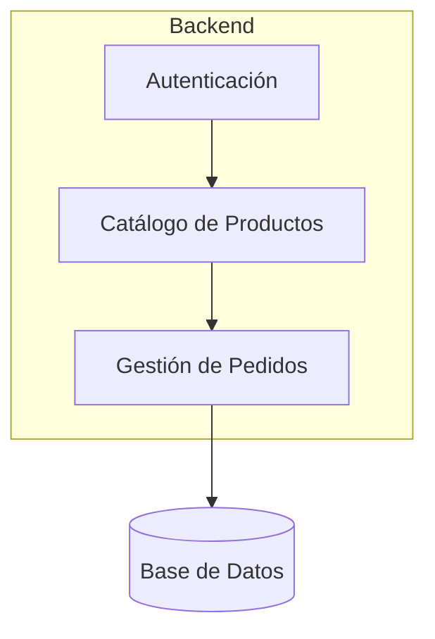
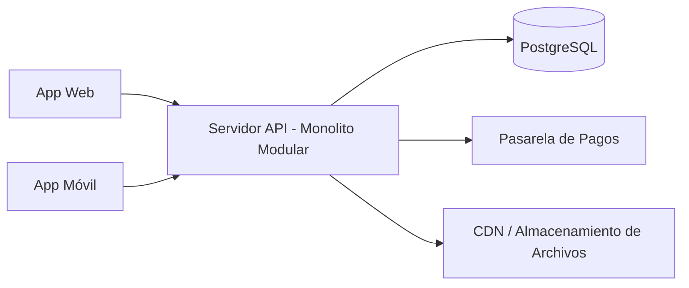

# Guía de Diagramas para Arquitectura

## Diagrama de componentes

Usa `graph TD` (top-down) o `graph LR` (left-right) según lo que sea más legible.

- Representa cada módulo/componente funcional como un nodo.
- Las flechas indican dependencia o flujo de datos, no orden de ejecución.
- No incluyas más de 10-12 nodos; si hay más componentes, agrúpalos en subgrafos (`subgraph`).
- Nombra los nodos con el nombre real del componente (ej. "Módulo de Pagos"), no genéricos como "Módulo 1".

Ejemplo:

## Diagrama de despliegue

Usa `graph LR` normalmente, mostrando de izquierda a derecha: cliente(s) → capa de aplicación → almacenamiento/servicios externos.

- Incluye siempre: clientes (web/móvil), servidor(es) de aplicación, base de datos, y servicios de terceros relevantes (pagos, CDN, mensajería).
- Si hay múltiples entornos (desarrollo/producción), no los mezcles en el mismo diagrama — usa uno solo para producción salvo que el usuario pida lo contrario.

Ejemplo:

## Nivel de detalle

Estos diagramas son de **alto nivel** — para arquitectura, no para documentación de infraestructura detallada (eso sería un diagrama de red o IaC, fuera del alcance de esta skill). El objetivo es que cualquier desarrollador nuevo entienda la forma general del sistema en menos de un minuto.
