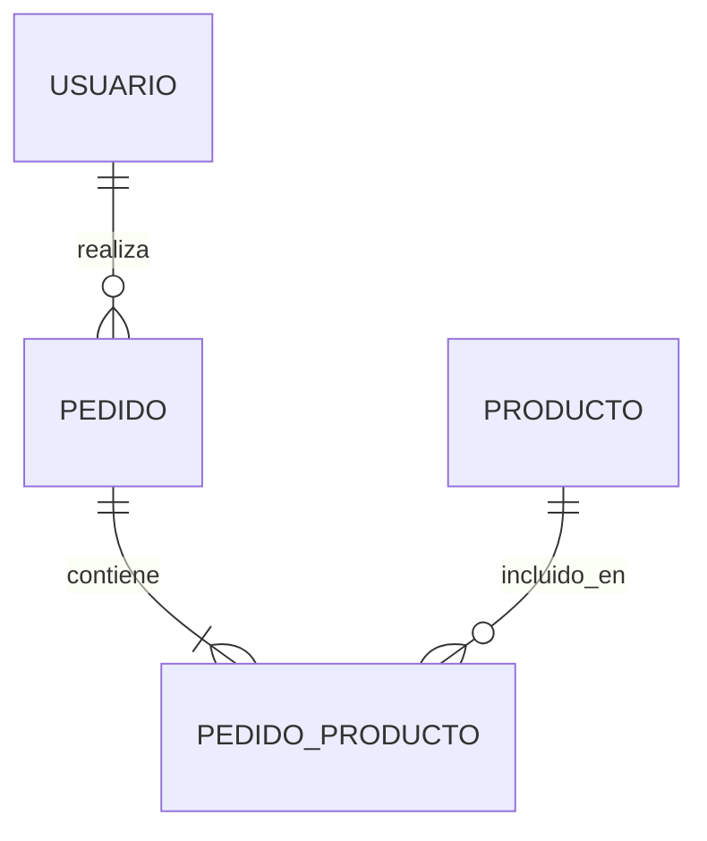

# Documento de Diseño de Base de Datos — [Nombre del Proyecto]

**Fecha:** [fecha]
**Versión:** 1.0
**Basado en:** [referencia a requisitos y/o arquitectura, si existen]

---

## 1. Resumen de la Decisión

[SQL / NoSQL / Híbrido, y justificación en 1 párrafo]

---

## 2. Diagrama Entidad-Relación

---

## 3. Descripción de Entidades

### Entidad: [Nombre] (ej. Usuario)

**Propósito:** [para qué existe esta entidad]

| Campo | Tipo | Restricciones | Descripción |
|-------|------|----------------|-------------|
| id | UUID/serial | PK | Identificador único |
| [campo] | [tipo] | [not null / unique / etc.] | [descripción] |
| created_at | timestamp | not null | Fecha de creación |
| updated_at | timestamp | not null | Última actualización |

### Entidad: [Siguiente]

**Propósito:** [...]

| Campo | Tipo | Restricciones | Descripción |
|-------|------|----------------|-------------|
| ... | ... | ... | ... |

---

## 4. Relaciones

| Entidad A | Entidad B | Cardinalidad | Comportamiento al borrar |
|-----------|-----------|--------------|----------------------------|
| Usuario | Pedido | 1 a muchos | Restringir borrado si tiene pedidos |
| Pedido | Producto | muchos a muchos (vía Pedido_Producto) | Cascada en tabla intermedia |

---

## 5. Consideraciones de Diseño

- **Normalización:** [nivel aplicado, o desnormalización deliberada y por qué]
- **Campos derivados/calculados:** [si existen, cuáles y por qué]
- **Índices recomendados:** [campos que deberían indexarse y por qué, a alto nivel]

---

## 6. Supuestos y Preguntas Abiertas

### Supuestos asumidos
- [supuesto 1]

### Preguntas pendientes de confirmar
- [pregunta 1]
