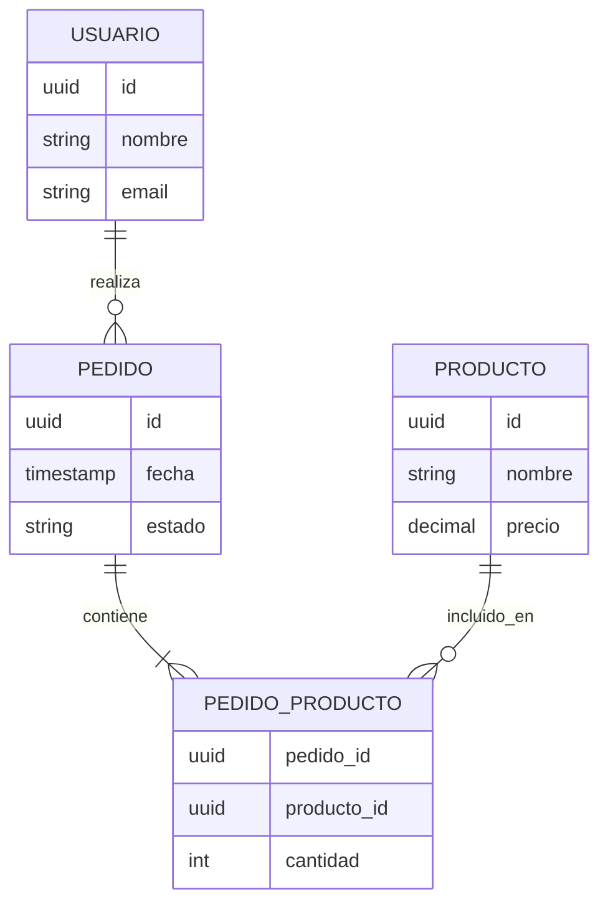

# Guía de Diagrama Entidad-Relación (Mermaid)

Usa la sintaxis `erDiagram` de Mermaid para todos los diagramas ER.

## Notación de cardinalidad

- `||--o{` : uno a muchos (opcional del lado muchos)
- `||--|{` : uno a muchos (obligatorio al menos uno)
- `}o--o{` : muchos a muchos
- `||--||` : uno a uno

## Convenciones

- Nombra las entidades en singular y mayúsculas (ej. `USUARIO`, no `usuarios` ni `Users`).
- Usa el verbo de la relación en español, en minúscula, sobre la línea (ej. `realiza`, `contiene`, `pertenece_a`).
- Para relaciones muchos-a-muchos con atributos propios (ej. cantidad en una línea de pedido), crea una entidad intermedia explícita en vez de forzar la notación `}o--o{` directamente — refleja mejor el modelo relacional real.
- No incluyas los atributos dentro del diagrama Mermaid salvo que el proyecto sea muy pequeño (menos de 5 entidades); para proyectos más grandes, los atributos van en la sección de "Descripción de Entidades" en tablas, y el diagrama se queda solo con las relaciones para mantenerlo legible.

## Ejemplo completo

Nota: incluir atributos dentro del diagrama (como en el ejemplo) es válido para proyectos pequeños/medianos donde ayuda a la legibilidad global. Para proyectos grandes, omítelos del diagrama y remite a la sección de tablas del documento.
