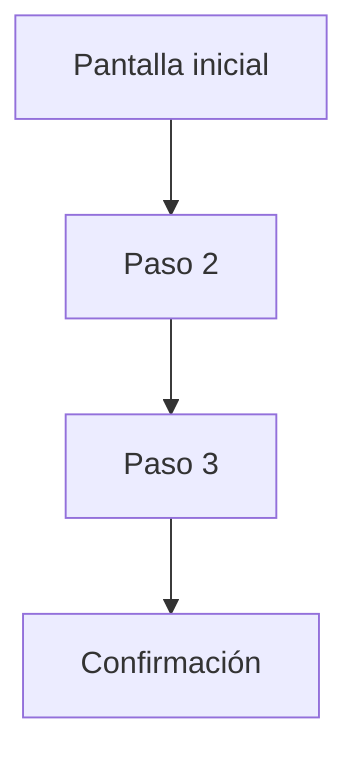

# Documento de Diseño UX/UI — [Nombre del Proyecto]

**Fecha:** [fecha]
**Versión:** 1.0
**Basado en:** [referencia a requisitos, arquitectura y/o base de datos, si existen]

---

## 1. Resumen de Dirección de Diseño

[Tono general del diseño y por qué encaja con el proyecto, en 1 párrafo]

---

## 2. Flujos de Usuario

### Flujo: [Rol] — [Objetivo] (ej. Vendedor — Publicar un producto)

1. [Paso 1: qué ve y qué hace el usuario]
2. [Paso 2]
3. [Paso 3]

### Flujo: [Siguiente rol/objetivo]

[...]

---

## 3. Sistema de Diseño Básico

### Paleta de color

| Color | Hex | Uso |
|-------|-----|-----|
| Primario | #XXXXXX | [uso] |
| Secundario | #XXXXXX | [uso] |
| Acento | #XXXXXX | [uso] |
| Fondo | #XXXXXX | [uso] |
| Texto | #XXXXXX | [uso] |

### Tipografía

| Rol | Tipografía | Uso |
|-----|------------|-----|
| Display | [fuente] | Títulos y encabezados |
| Cuerpo | [fuente] | Texto general |
| Utilitaria | [fuente] | Datos, etiquetas, captions |

### Componentes base

- **Botón primario**: [descripción + estados: normal, hover, activo, deshabilitado]
- **Input de texto**: [descripción + estados]
- **Card**: [descripción]

---

## 4. Descripción de Pantallas

### Pantalla: [Nombre]

**Propósito:** [para qué existe esta pantalla]
**Elementos:** [lista de elementos principales]
**Acción principal:** [qué se espera que haga el usuario aquí]

### Pantalla: [Siguiente]

[...]

---

## 5. Estados de UI

### Pantalla: [Nombre de pantalla relevante]

- **Carga:** [cómo se comunica que algo está cargando]
- **Error:** [mensaje y acción sugerida ante un error]
- **Vacío:** [qué se muestra cuando no hay datos, y qué invita a hacer]

---

## 6. Supuestos y Preguntas Abiertas

### Supuestos asumidos
- [supuesto 1]

### Preguntas pendientes de confirmar
- [pregunta 1]
